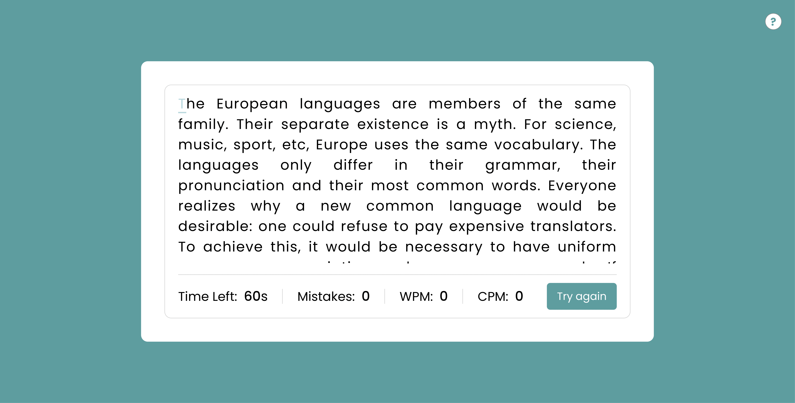

# Type Speed

**Type Speed** is a simple browser-based game to test and improve your typing speed. It’s built using HTML, CSS, and JavaScript with no external dependencies.

## Live Demo

👉 [Play Now](https://totioti.github.io/type-speed/)

## Screenshot

 <!-- Add this image to your repo if available -->

## Features

- Random texts for typing
- Word accuracy counter
- Countdown timer
- Automatic WPM (Words Per Minute) and CPM (Characters Per Minute) calculation
- Responsive design

## Run Locally

1. Clone the repository:
   ```bash
   git clone https://github.com/totioti/type-speed.git
